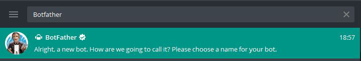
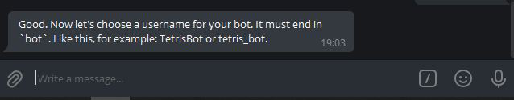
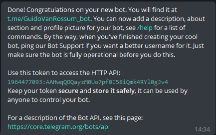

# Python Telegram Bot
This is a starting point for making your own Telegram bot using Python and the telebot library.

# Demo
Demo Of This Telegram Bot : https://t.me/imtestingmypybot or Search @imtestingmypybot

# Getting Started
To get set up, you'll need to follow these bot account setup instructions, and then copy the token for your bot and added it as a secret with the key of TOKEN in the "Secrets (Environment variables)" panel.

### Step 1 :
After opening an account on Telegram, in the search bar at the top search for “BotFather”

### Step 2 :
Click on the ‘BotFather’ (First Result Shown In Step 1) and type **/newbot**

### Step 3 :
Give a unique name to your bot. After naming it, Botfather will ask for its username. Then also give a unique name But remember the username of your bot must end with the **bot**, like my_bot, mybot etc.

### Step 4 :
After giving a unique name and if it gets accepted you will get a message something like this –

Here the token value will be different for you, we will use this token in our python code to make changes in our bot and make it just like we want, and add some commands in it